# AOP(通过CGLIB实现，CGLIB通过拦截器实现)
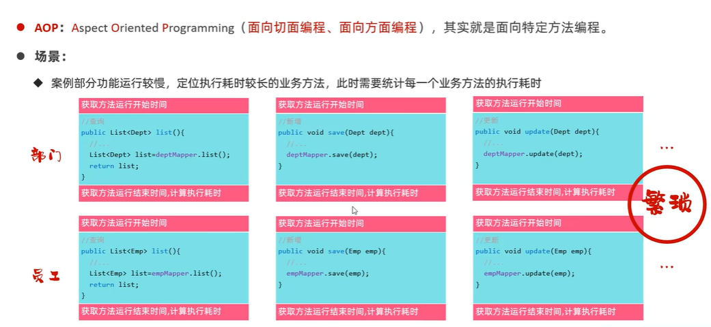

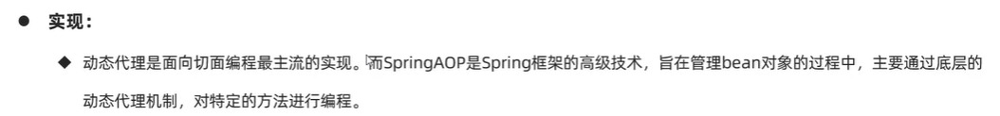

## 基本实现
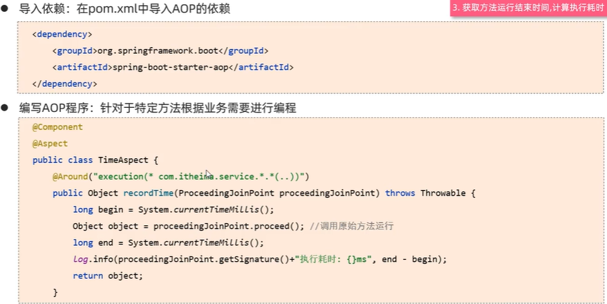

## 场景和优势
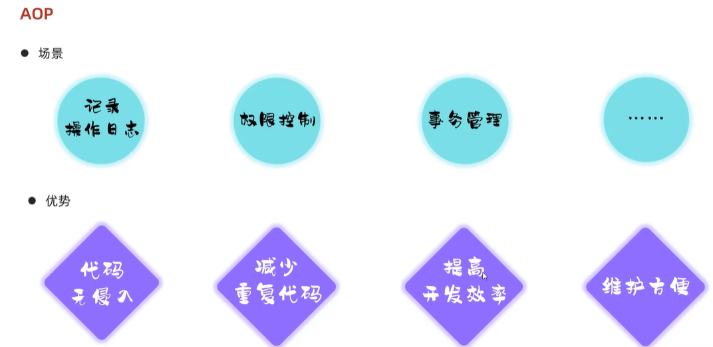

## 核心概念
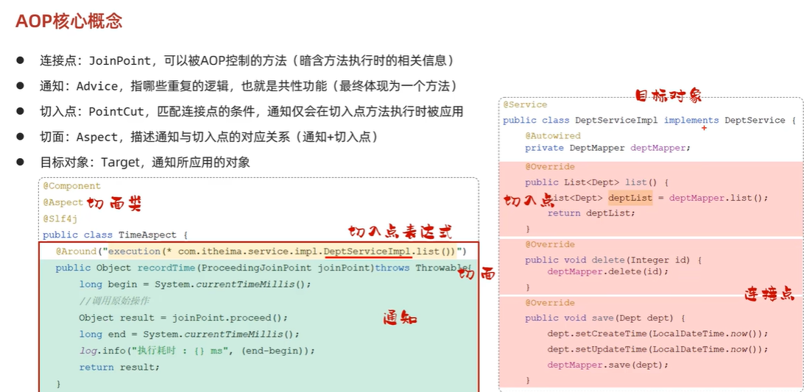

## 执行流程
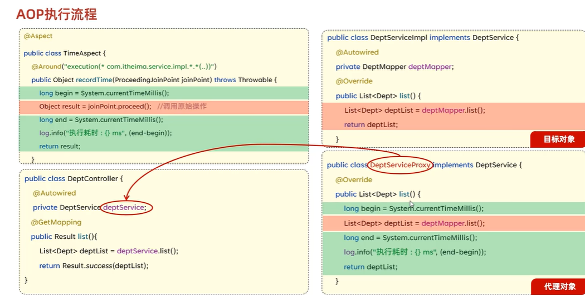

## 通知类型
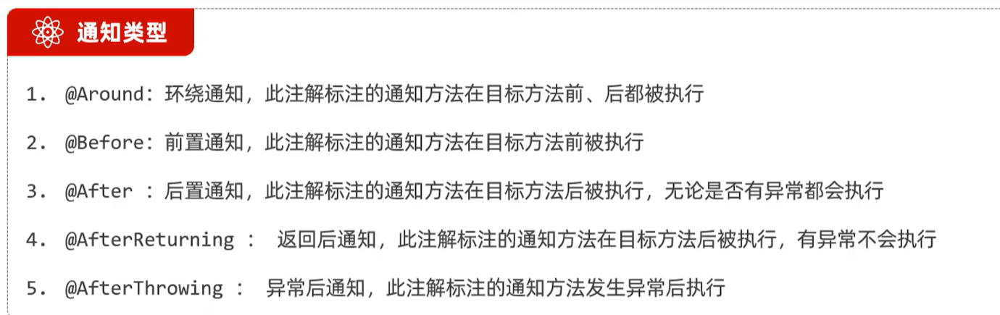

注意：
* @After和@AfterReturning的区别：@After不管原始方法调用是否成功，都执行，@AfterReturning只有在原始方法正常执行时才会执行
* @Around在原始方法后面的通知只有在原始方法成功调用时才会运行，类似于@AfterReturning
* 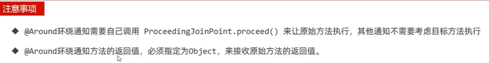

## 切入点表达式提取
定义：
```java
@Pointcut("execution(* com.wuzengrui.service.impl.DeptServiceImpl.*(..))")
    public void pt(){}
```

使用：
```java
@Before("pt()")
public void before(){
    log.info("before ...");
}
```

## 通知顺序

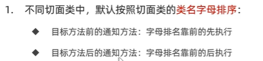
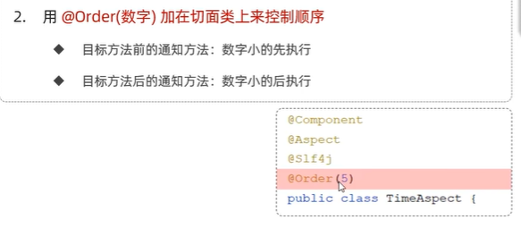

## 切入点表达式

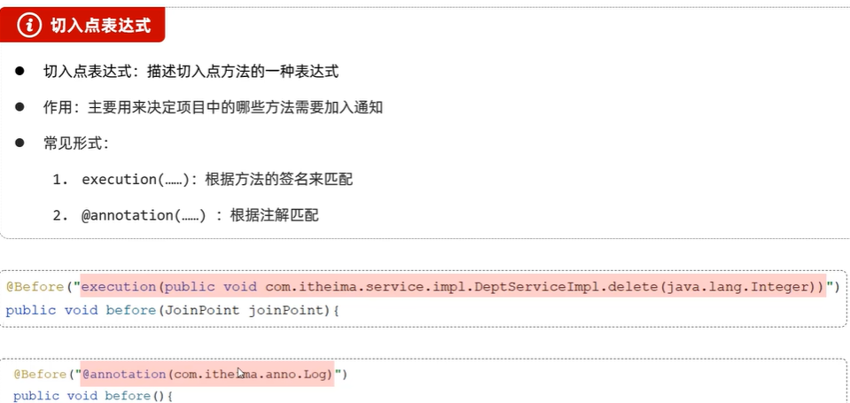

### execution
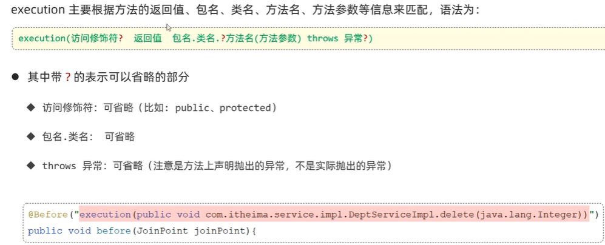

execution(public void com.wuzengrui.service.imp.DeptServiceImpl.delete(java.lang.Integer))
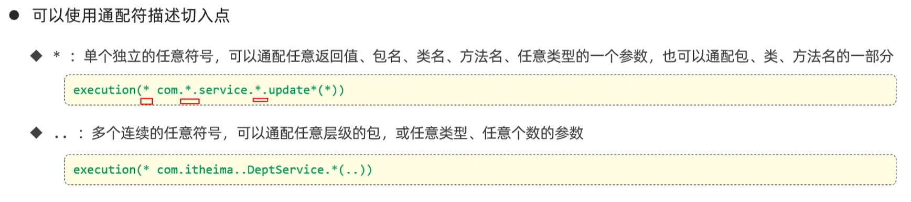

多个切入点的表达式

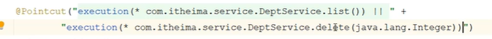

#### 书面建议
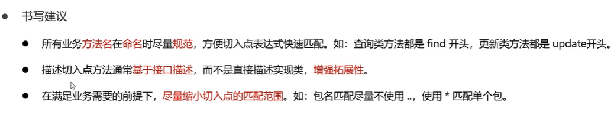

### annotation

创建一个annotation
```java
@Retention(RetentionPolicy.RUNTIME)
@Target(ElementType.METHOD)
public @interface MyLog {
}
```
然后在想要切入的方法上加上@MyLog标签
最后在aop上注释annotation所在的包就行了
例如：

```java
import org.aspectj.lang.annotation.Around;

@Around("@annotaion(com.wuzengrui.aop.MyLog)")
```
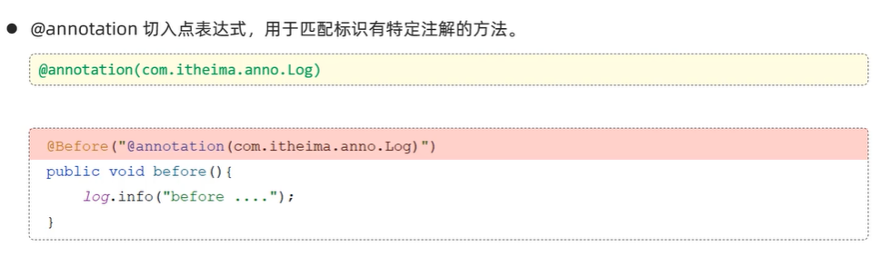

## 连接点
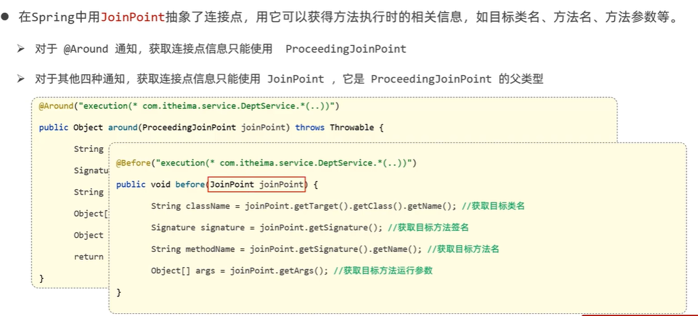
