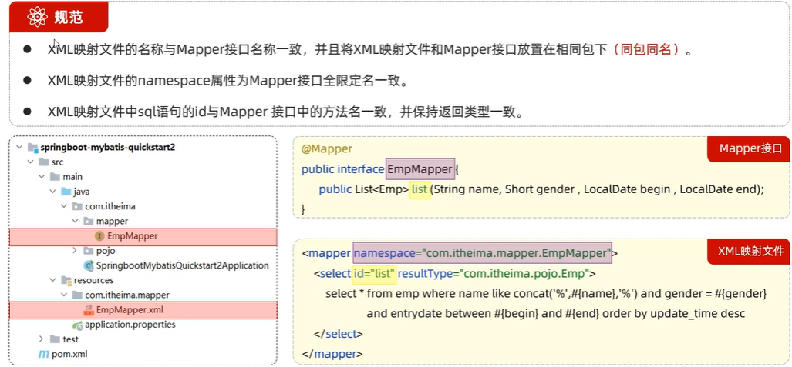
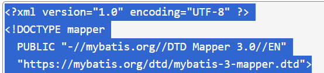
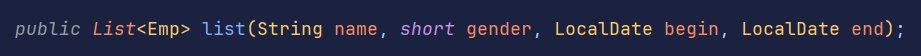
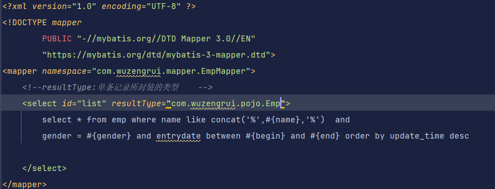

# 规范

定义包名时不能使用.来分隔，应该用/分隔


所有xml映射文件的约束都是固定的，如图所示

```xml
<?xml version="1.0" encoding="UTF-8" ?>
<!DOCTYPE mapper
  PUBLIC "-//mybatis.org//DTD Mapper 3.0//EN"
  "https://mybatis.org/dtd/mybatis-3-mapper.dtd">
<mapper>
    
</mapper>
```

例子：



推荐插件：mybatisX