# mybatis增删改查（crud）

## 删

## 增
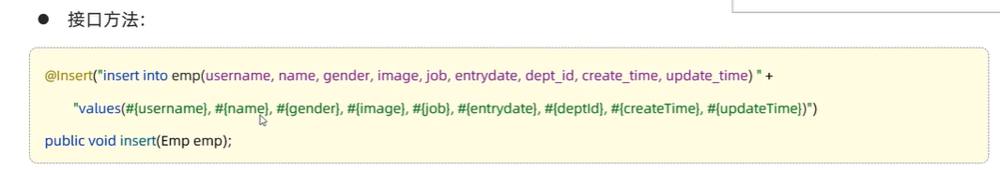
可以自动识别对象中的属性

### 主键返回
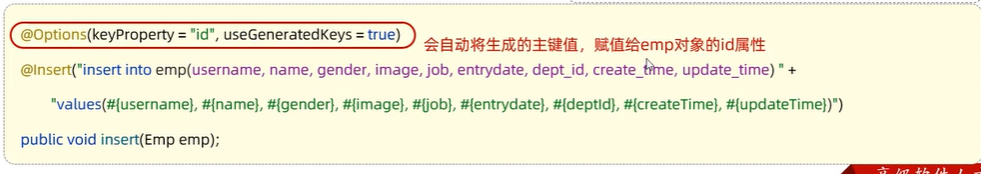

## 获取mybatis日志

语法：
mybatis.configuration.log-impl=org.apache.ibatis.logging.stdout.StdOutImpl

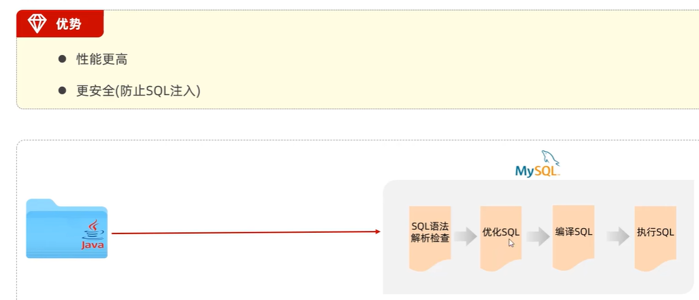

# 查

模糊匹配时用字符串拼接
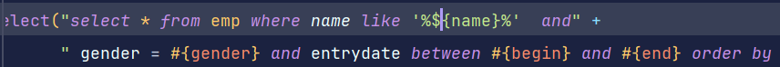
或者使用concat对字符串进行拼接
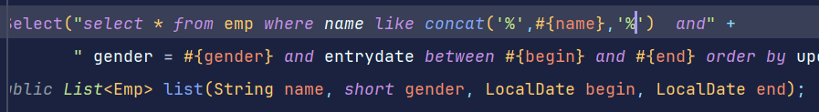
## 数据封装
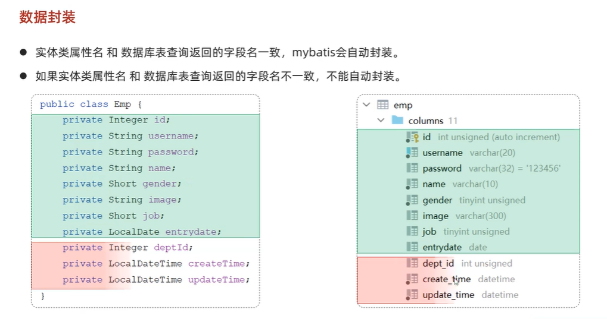
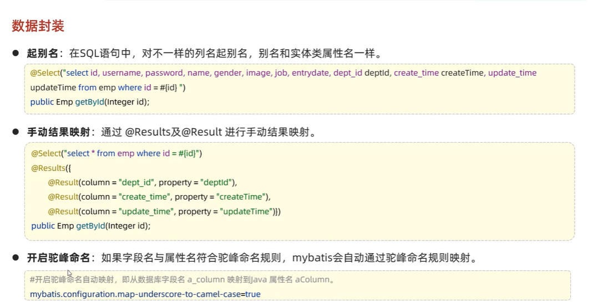
解决方法
* 1：起别名

让字段名和实体类的属性名一致
* 2：用@Results和@Result标签
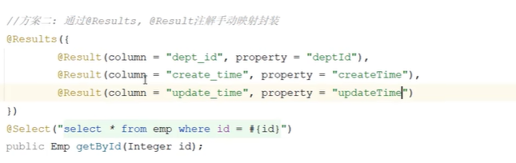
* 3：开启mybatis的驼峰命名自动映射开关
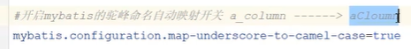
## 安全性的说明（sql注入）
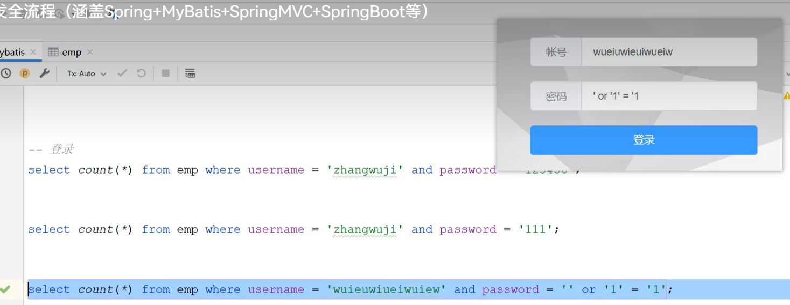
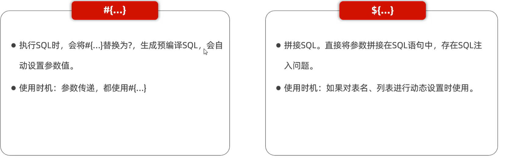
