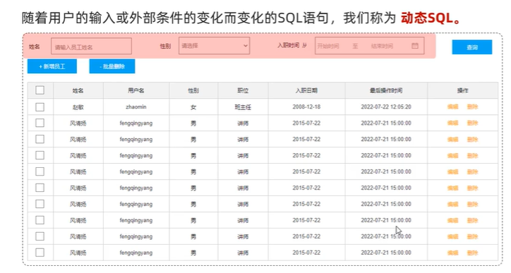
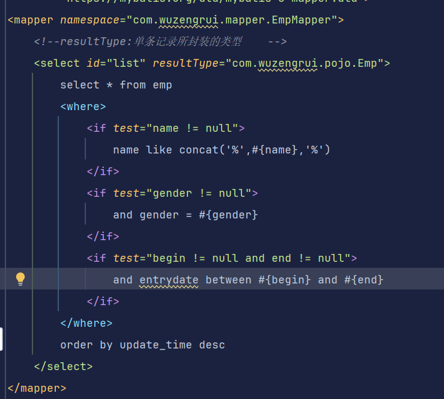
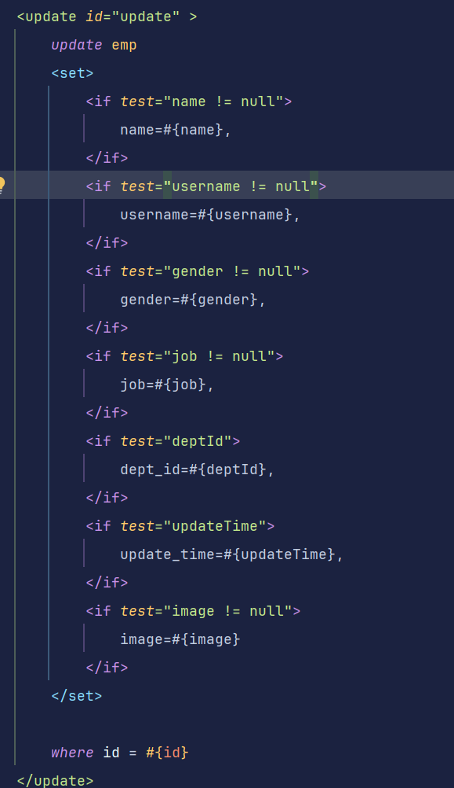
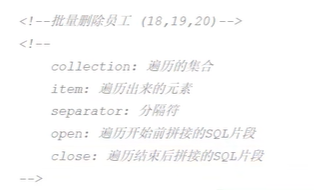
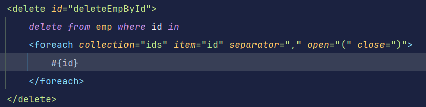
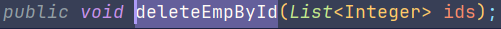
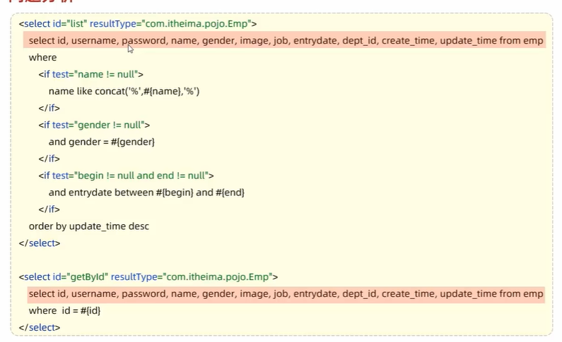
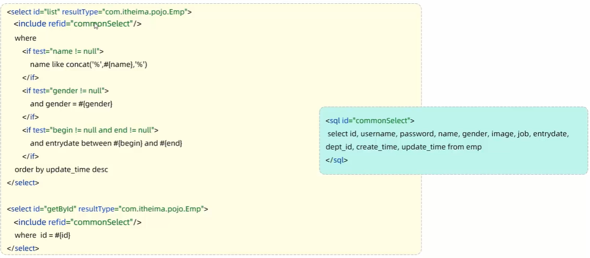
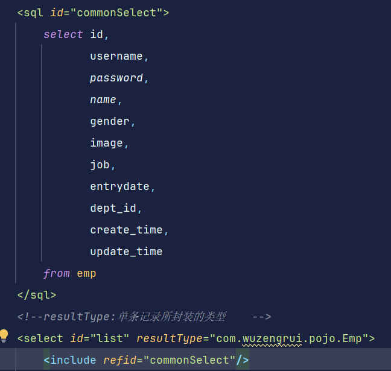

# 应用场景

## <if>
如果判断为true则拼接相应的sql语句
案例：

where标签的作用，如果后面的if条件全部为false时则不会生成where关键字，并且判断是否需要添加and关键字（比如案例中如果没有传递name属性而传递gender属性时，前面的and关键字就不会被添加）

强化案例：

## <foreach>(批量删除)

## <sql><include>

使用前：

使用后：

