## 配置优先级

优先级排序：命令行参数>Java系统属性>.properties>.yml>.yaml

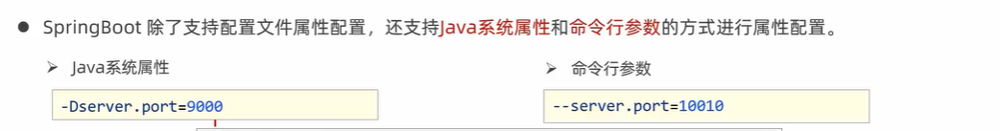

打包后的项目如何配置属性：

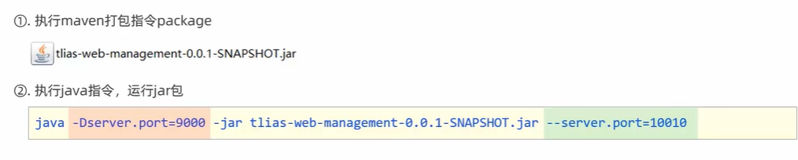

## Bean管理

### 获取bean
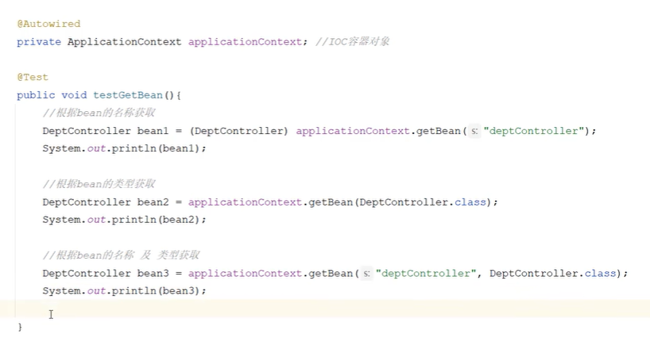

### bean的作用域

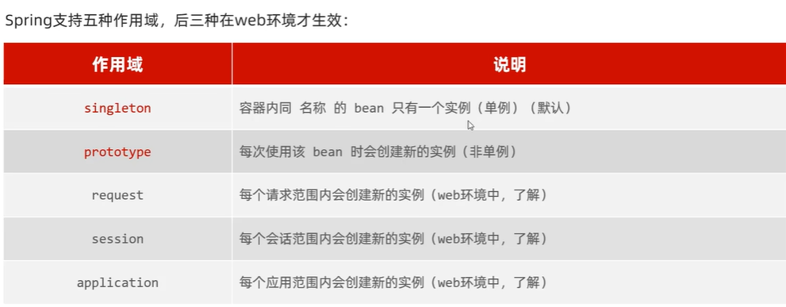

配置bean的作用域

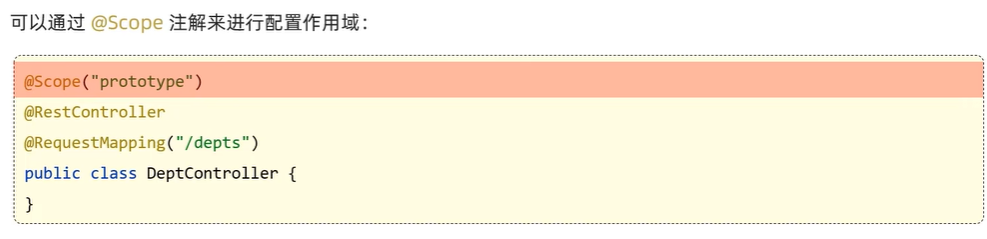

关于@Lazy的说明：

对于一些不常用的Bean，延迟加载可以避免在启动时初始化所有Bean，从而减少启动时间;  按需加载资源：某些Bean依赖于外部资源（如数据库连接或远程服务），在系统启动时可能不需要立即加载。

注意：

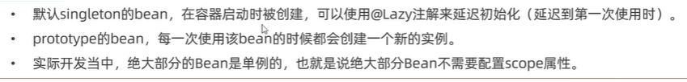

### 第三方bean

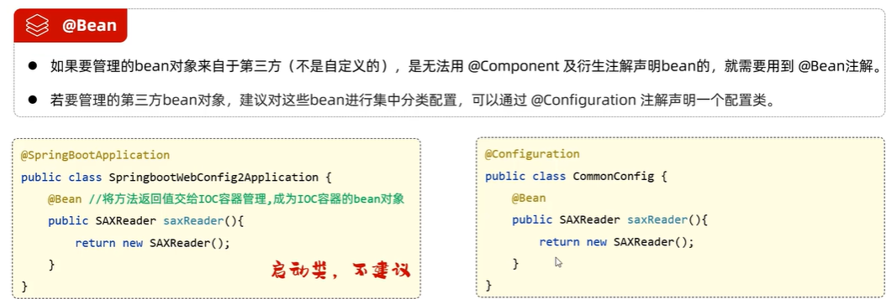

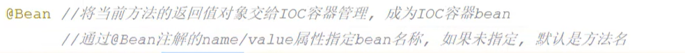

像这样：

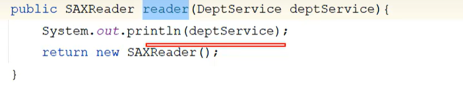

使用场景：

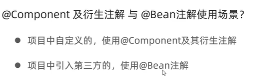

# Springboot原理

## 起步依赖
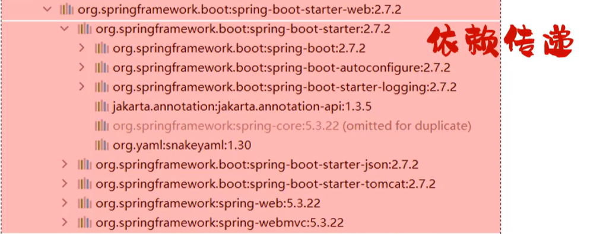

相较于spring框架，不容易出现版本冲突问题，一切都是maven的依赖传递的功劳

## 自动配置

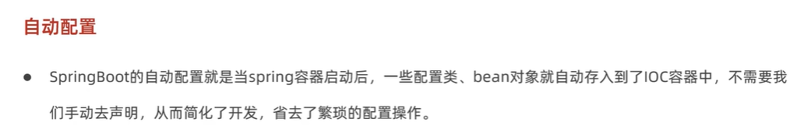

### 自动配置原理

@SpringBootApplication扫描bean对象的范围是：当前包及其子包

如果想配置其他包中的bean对象则有以下方案：

1.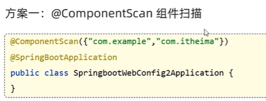

如果用@ComponentScan这个标签的话，原来的@SpringbootApplication扫描的包就会被覆盖，所以一般需要加上当前包，而且每添加一个包就需要在@ComponentScan中添加新的包名，非常繁琐

2.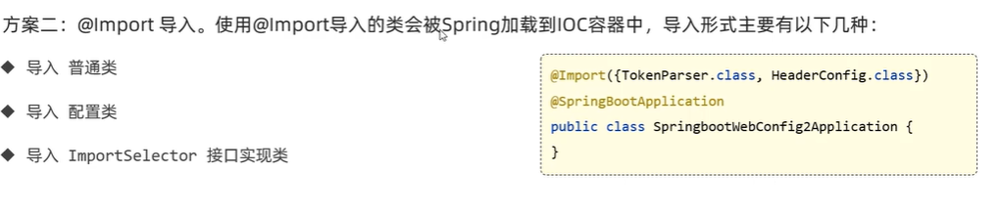
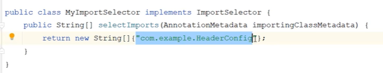
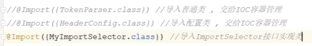

Springboot使用的方式：一般都在第三方依赖的@EnableXXXX注解标明哪些依赖是需要引入的

原码跟踪：
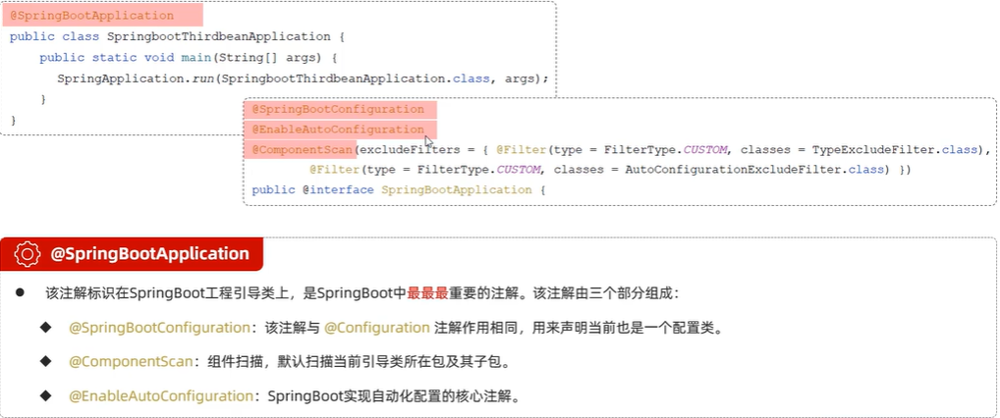
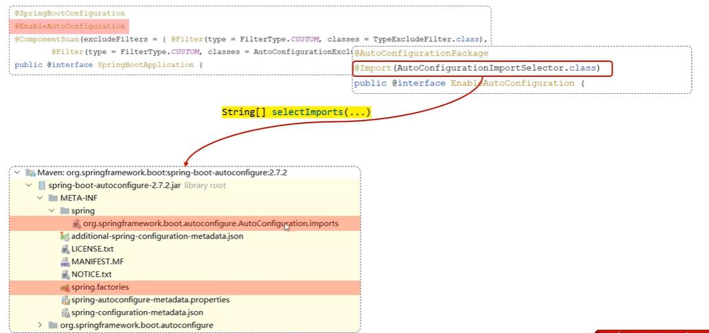

#### @Conditional
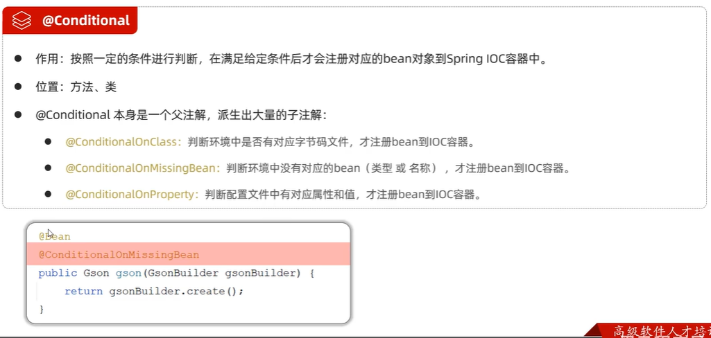
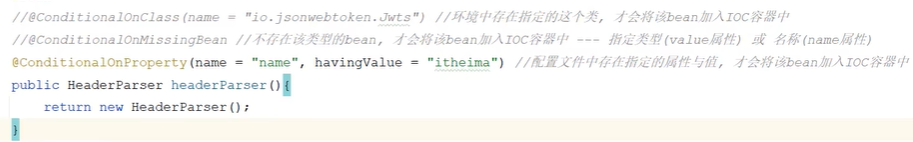

#### 自定义 starter
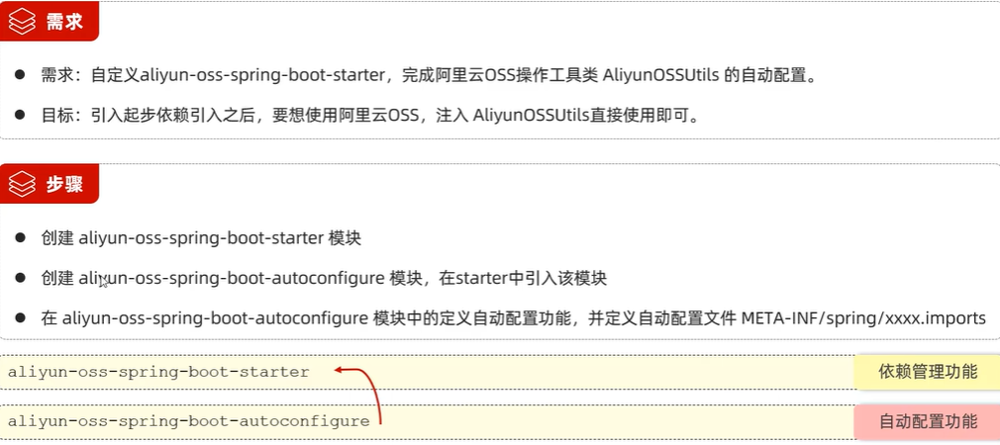

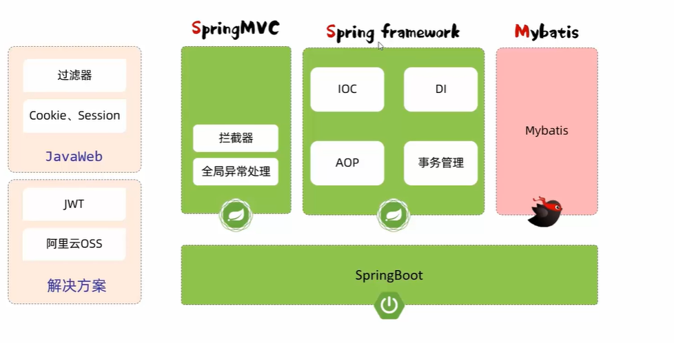