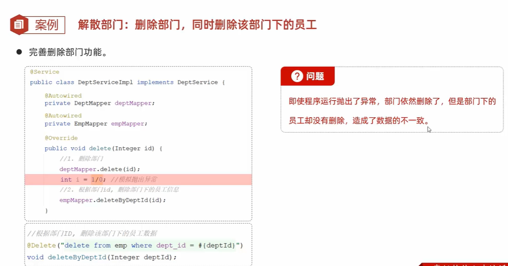
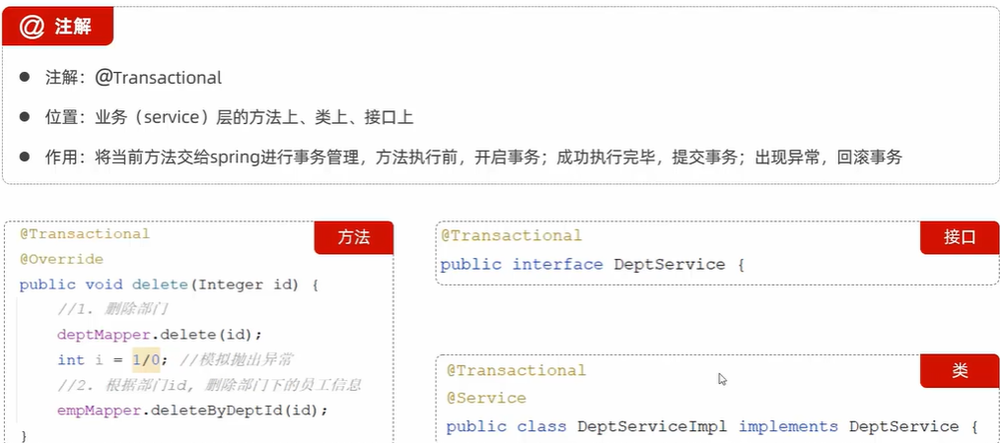
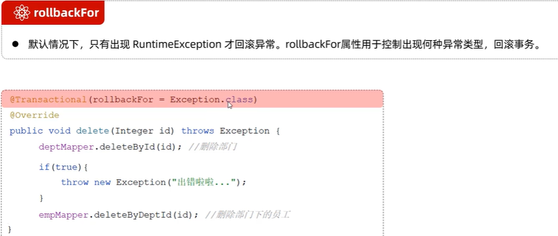
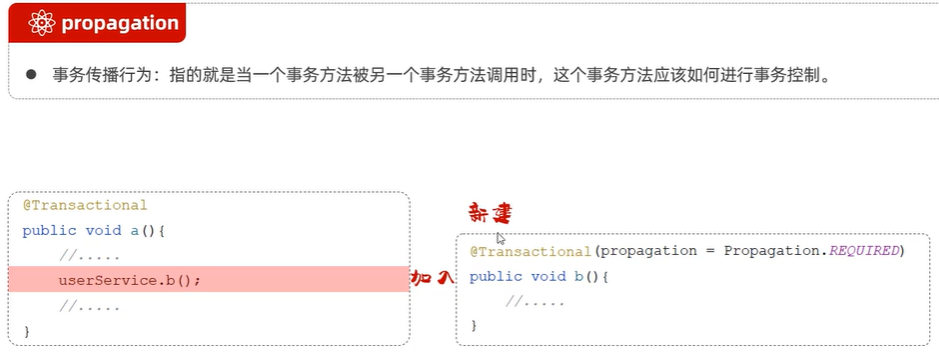
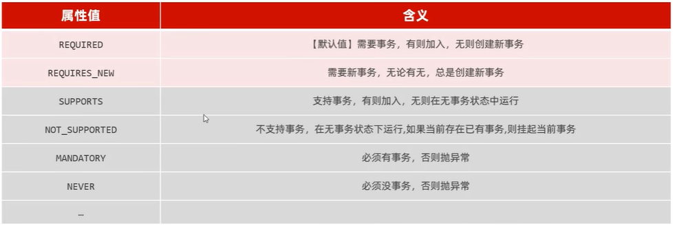
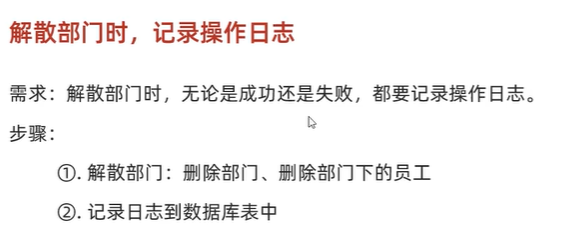

# 事务管理出现的情景


# 事物管理的注解



springboot开启事物管理日志的设置

```yml
logging:
 level:
  org.springframework.jdbc.support.JdbcTransactionManager: debug
```

## rollbackFor
默认是RuntimeException



## propagation


## propagation的行为种类


## 案例


分析：
因为无论能否成功解散部门，日志都需要记录，所以记录日志和解散部门是两种不同的事物，所以记录日志的方法的propagate的值应该是propagate.REQUIRES_NEW