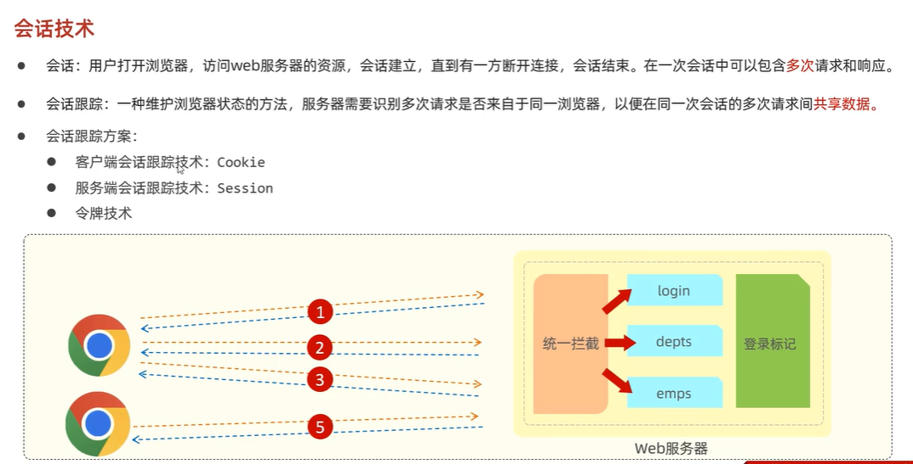

会话技术本质上都是想要共享数据
# 对比
存储在浏览器中

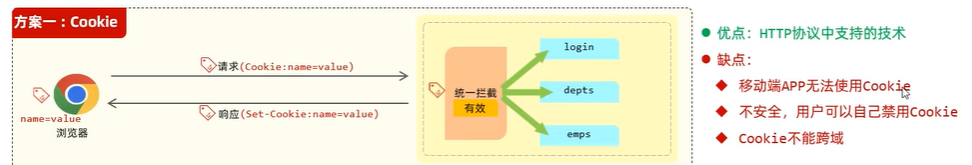

存储在服务端
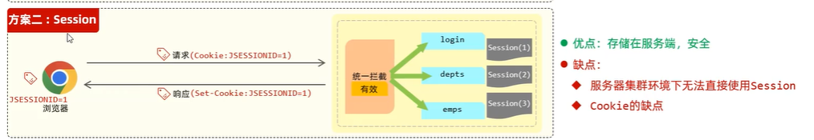

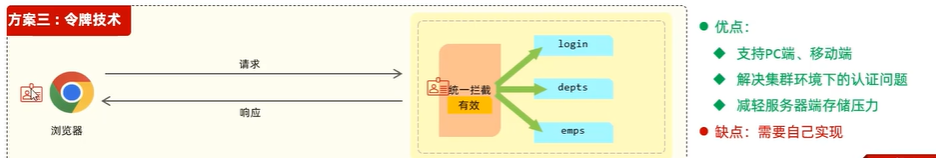

# 令牌技术
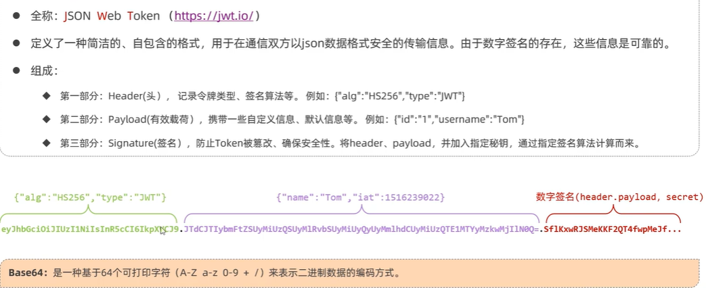

场景：
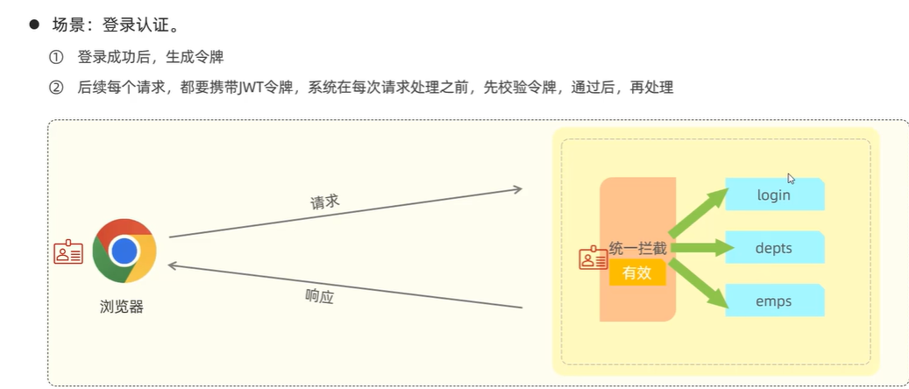

# JWT（JSON Web TOKEN）令牌技术的实现
## 1.依赖
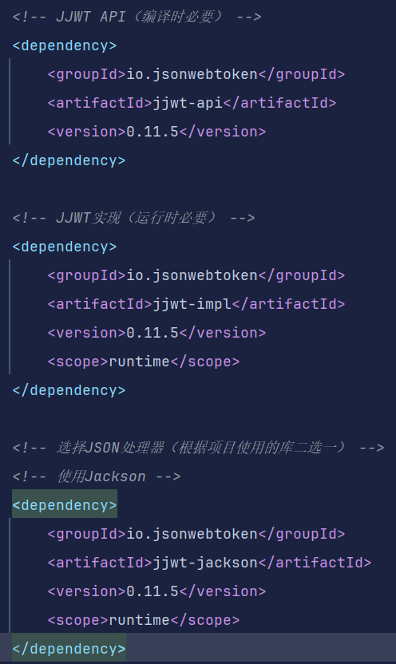

## 2.调用API（生成jwt令牌）
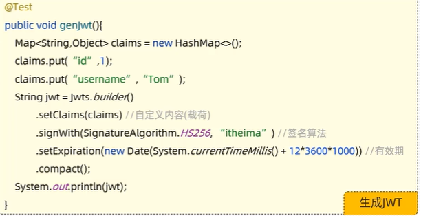

案例：
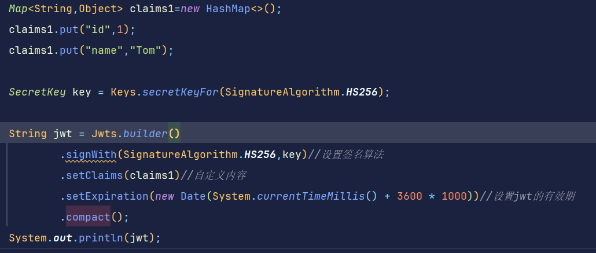

注意：
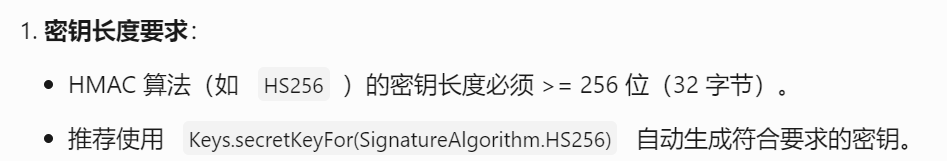，也就是案例中的signWith中的第二个参数

## 3.解析Jwt令牌

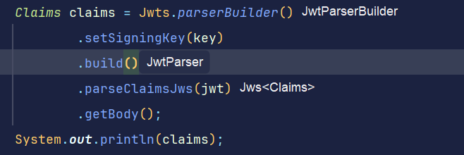
注意：
这里的setSigningKey()方法里面的key参数必须和之前生成令牌所用的key参数保持一致才能解析，如果报错的话说明jwt令牌给篡改了

