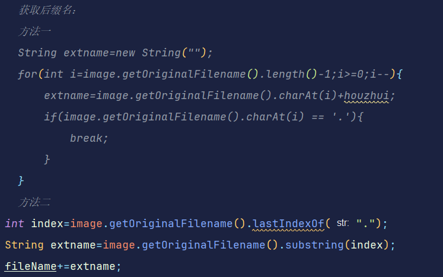
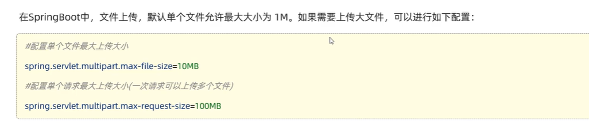
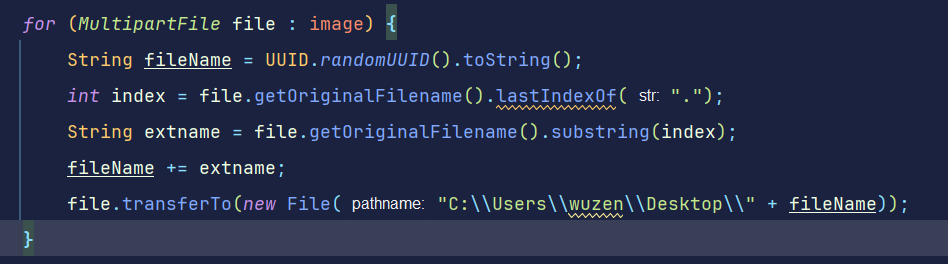
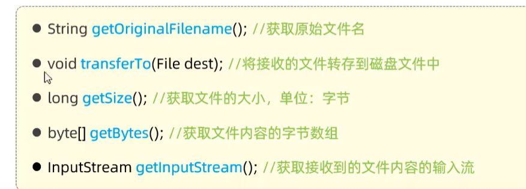

# 文件上传
## 前端
用表单提交
```html
<form action="/upload" method="post" enctype="multipart/form-data">
    姓名: <input type="text" name="username"><br>
    年龄: <input type="text" name="age"><br>
    头像: <input type="file" name="image"><br>
    <input type="submit" value="提交">
</form>
```
## 后端
将文件接收文件的类型设置为：MultipartFile类型
## 文件名重复问题
使用uuid
使用方法：UUID.randomUUID().toString();
获取文件后缀：

## 文件大小限制

## 传递同时多个文件


