# 过滤器Filter
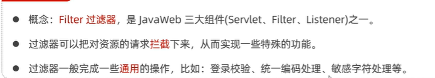

## 基本实现
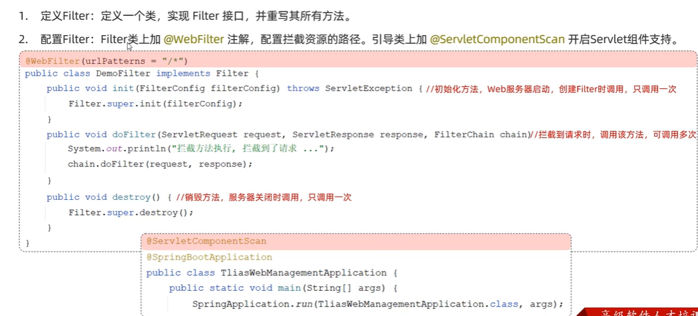
filterChain.doFilter(servletRequest, servletResponse);用来放行请求，让请求访问资源

## 执行流程
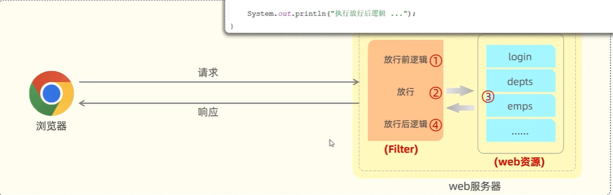
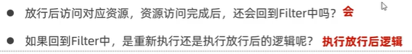

## 拦截路径
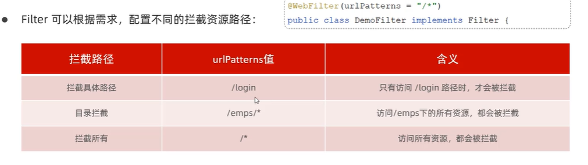

## 过滤器链
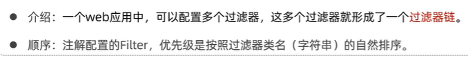

注意如何让filter失效
需要把@WebFilter和@Component一起注释掉才能让filter失效

# 拦截器Interceptor
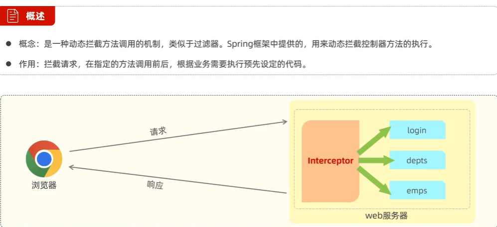

## 基本实现
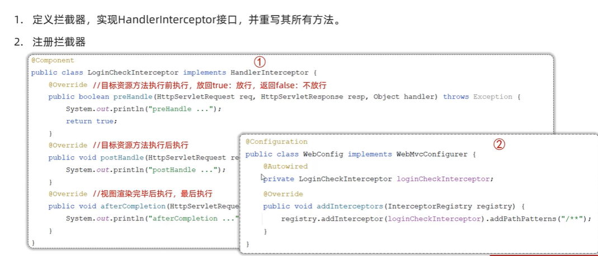

## 拦截路径配置
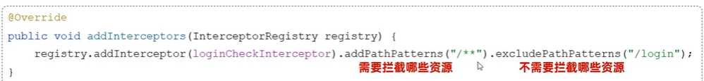
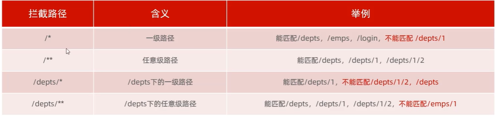

## 执行流程
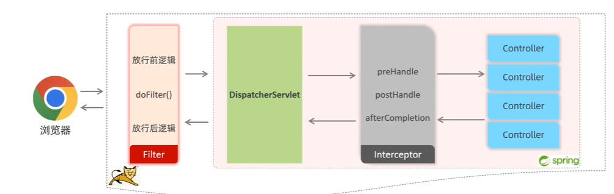

# 区别
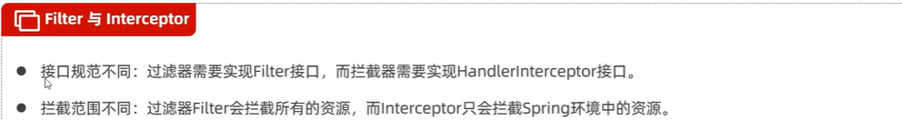