# 数据库的登录
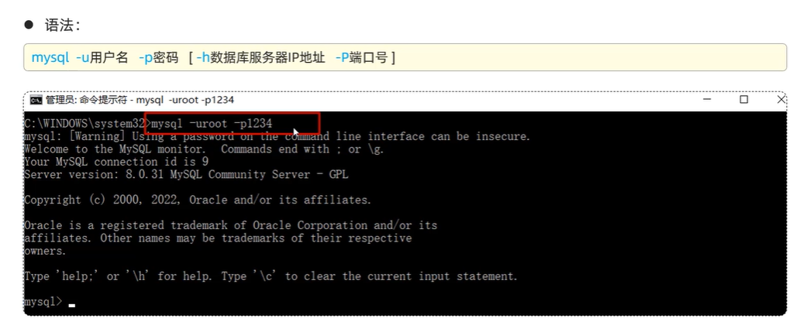
## 链接远程服务器上的数据库的方法
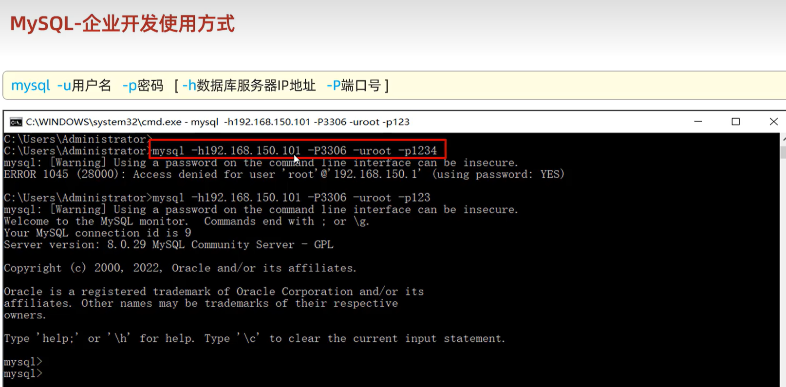

# sql语法
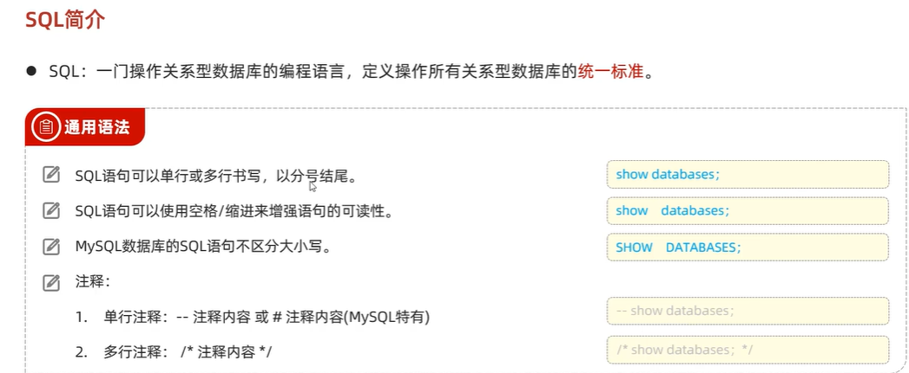
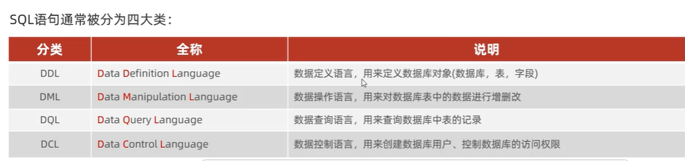

# ddl
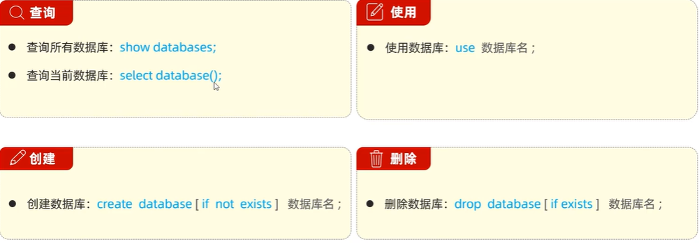
## 查询数据库
```shell
show databases;
```
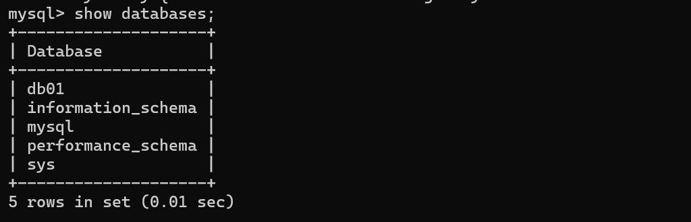
## 创建数据库
```shell
create database 数据库名
```

如果数据库不存在，再创建数据库
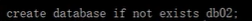
如何使用数据库+查看当前使用的是哪条数据库

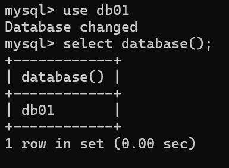

## 删除数据库
```shell
drop database 数据库名
```

如果数据库存在，再删除数据库


## 表结构创建

例如：
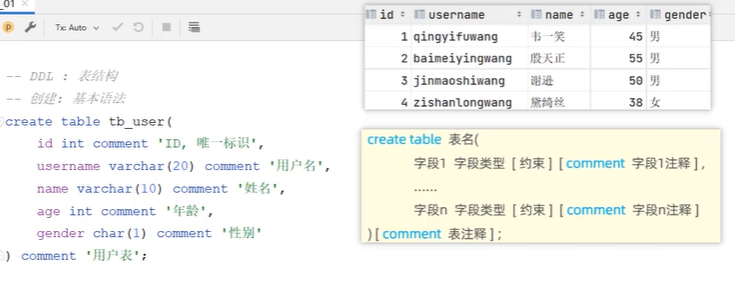
### 约束的类型

添加约束之后的创建表结构
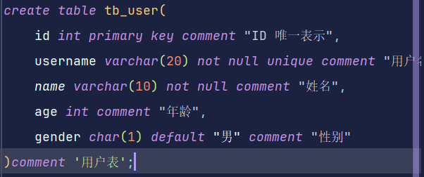
### 字段类型有哪些

#### 数值类型
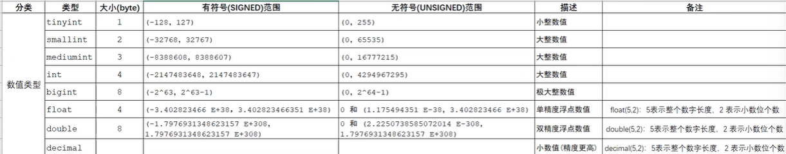
如果想添加无符号类型的话在数值类型后面加上unsigned


#### 字符串类型
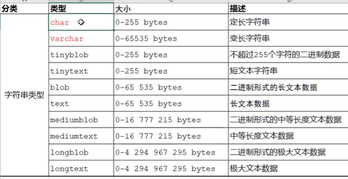
char和varchar之间的区别

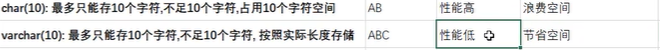

#### 日期时间类型
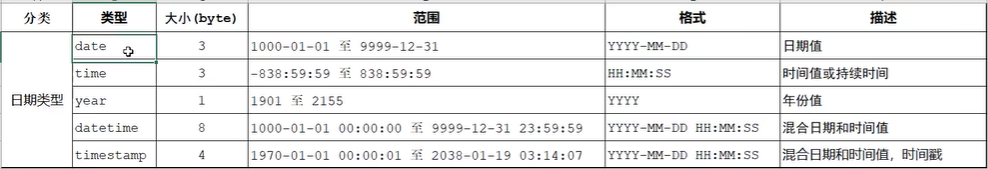

## 表查询


## 表修改


## 表删除
