# dql
基本语法：

## 基本查询
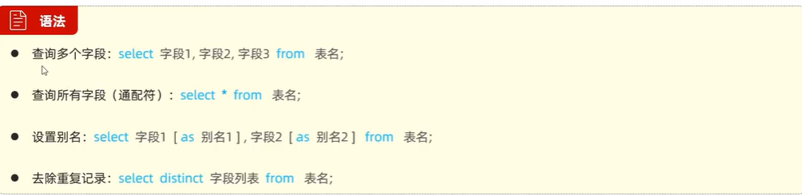

## 条件查询
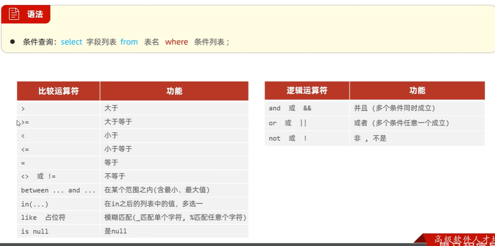

练习

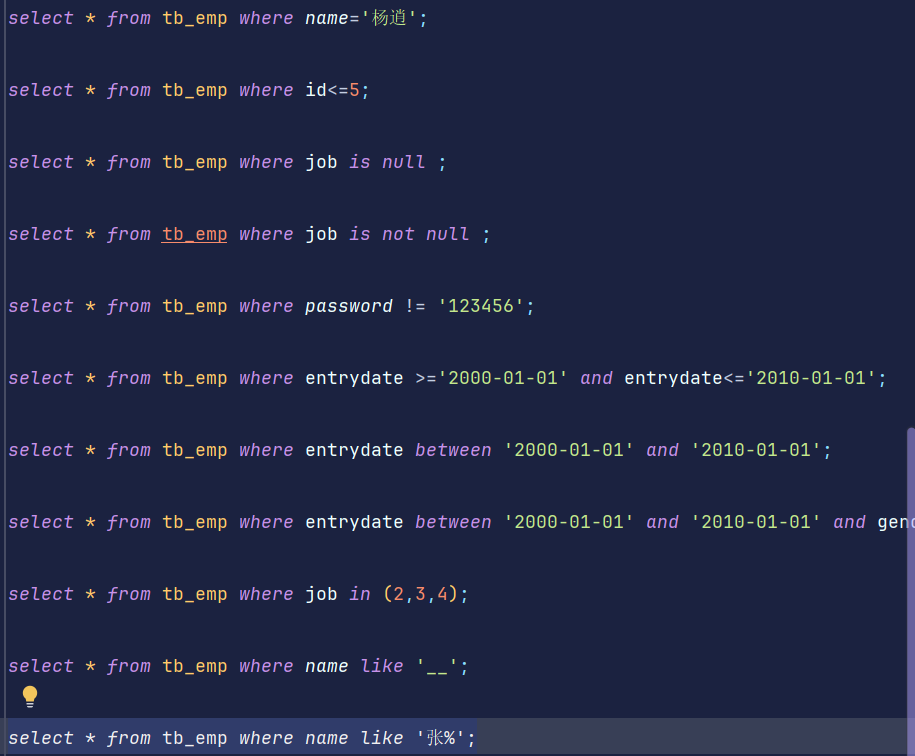

## 分组查询
### 聚合函数
注意：聚合函数不对null值进行运算

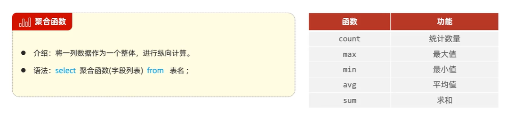
练习(聚合函数)

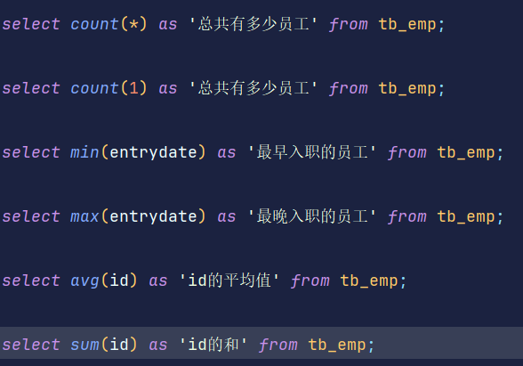

练习(分组查询)

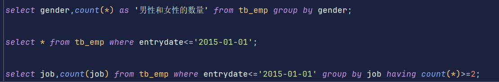
注意：分组查询使用group by，select返回的是分组字段+聚合函数的结果

having和where之间的区别
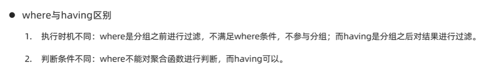

## 排序查询

ASC升序，DESC降序
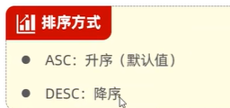

注意

## 分页查询
注意：索引是从0开始的

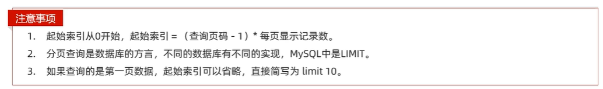

练习：

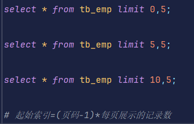

流程表达函数if(条件表达式,true值,false值)
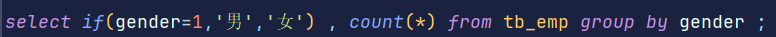

case 表达式 when 值1 then 结果1 when 值2 then 结果2 ... else ... end
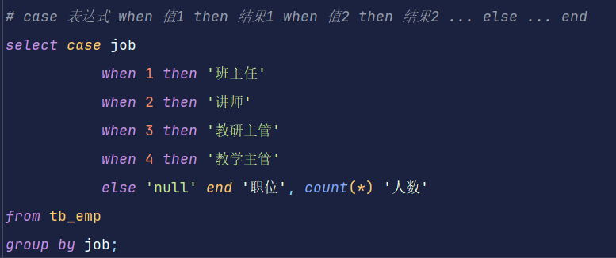

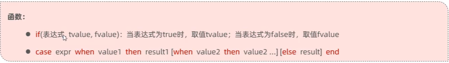
