# 多表查询

## 笛卡尔积
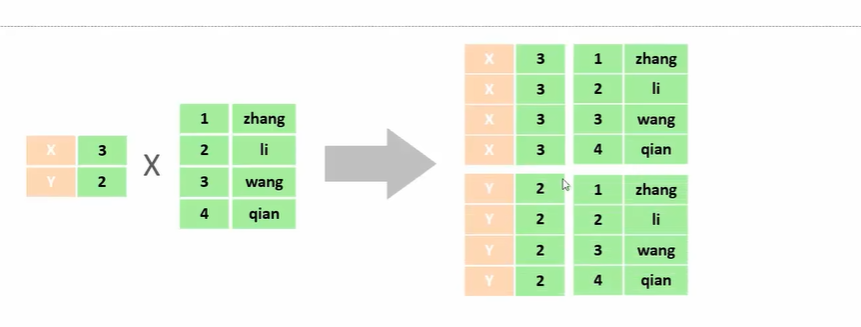
消除无效的笛卡尔积
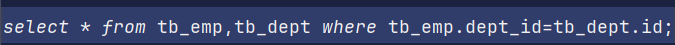

## 分类
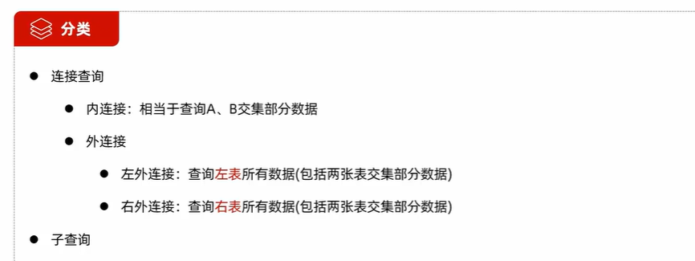

## 内连接

练习：

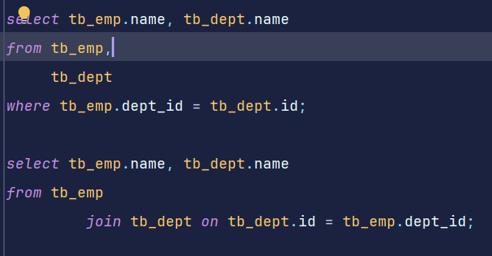

起别名：
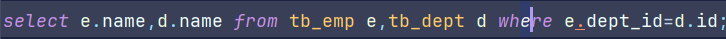

## 外连接

练习：
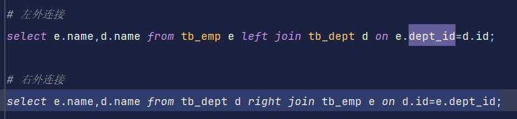

技巧：left join显示全部的左表（left join前面的那张表）信息，right join 显示全部的右表信息（right join后面的那种表）

## 子查询
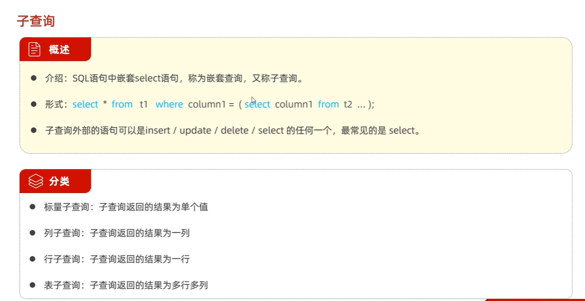

标量查询练习：

## 列子查询

列子查询练习：

## 行子查询

行子查询练习：
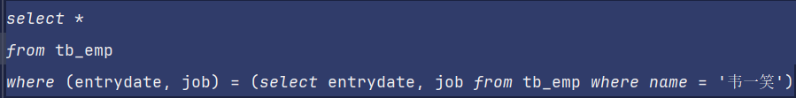

## 表子查询

表子查询练习：
作为一张临时表使用
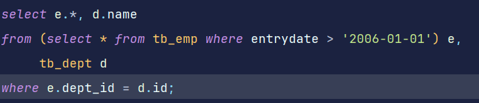

## 综合练习
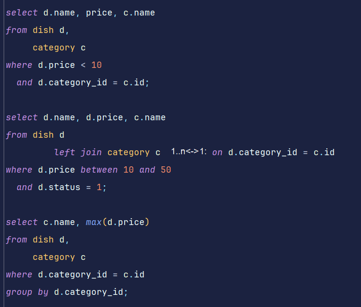
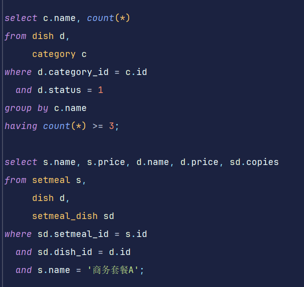

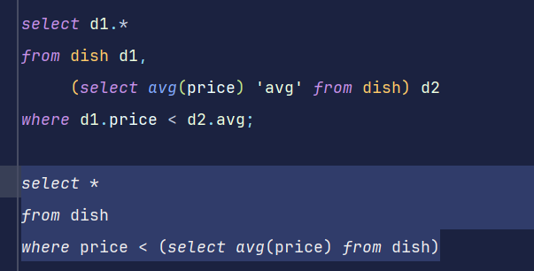